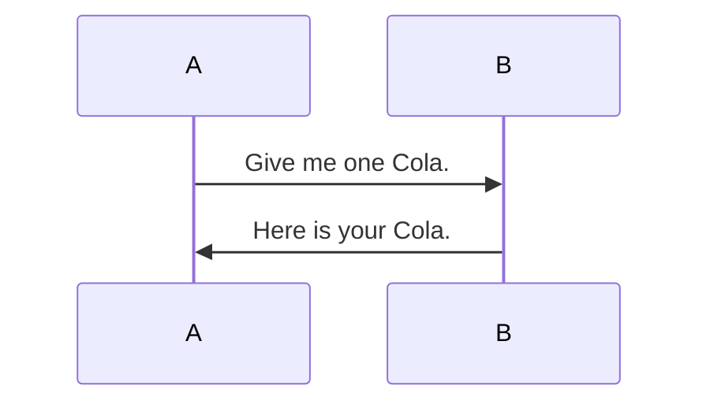

---
tags:
  - productivity
  - cheatsheet
---
# Useful commands
- new note ^new-note-tag
	- `Ctrl + N`
- change note name
	- `F2`
- command palette
	- `Ctrl + P`
	- use the command palette more often!
		- ex) deleting: ctrl + p + type delete
- quick switcher
	- find notes easily
	- `Ctrl + O`
- stack tabs
	- click the down arrow beside your tabs
	- useful if you want to reference all open tabs (to ur left) simultaneously
# Basic Markdown 
- Noting things that I don't normally use in case I'll forget
- highlighting text
	- `==<text>==`
- mermaid diagram
	- \`\`\`mermaid
	- you can learn the mermaid syntax

- Fold/unfold all headings and lists
	- use the command palette lol
- `---`
	- must have blank space above, or it will treat the thing above as a title
	- enables you to make slides (`Ctrl + P` > Slides)
- Different Modes
	- Can toggle different views with command palette or use `Ctrl + E`
	- Live preview
		- default
		- can edit, but after editing it's alr formatted
	- Source mode
		- click the `...` at the right
		- can check all markdown
	- Reading view
		- can't edit
- Changed default folder for image attachments
	- `Settings` > `OPTIONS` > `Files and links` > `Default locations for new attachments`
- Link
	- Pdfs: `![[pdf file name#page=4]]`
		- `page=4` can be used to choose default shown page
	- External link
		- ``
		- `[]` just holds alt text, `()` holds the URL
- Tags📌
	- Add `#Tag_name` to your note
	- Hierarchy: `#food/korean`
	- (I should prob look into tagging notes more seriously)
- Linking blocks
	- So far we've linked headings, but what about blocks? You need a unique Id
	- Manually make an Id
		- Put an Id next to whatever you want to reference, with a space before `^`
			- `This is a test. ^test-id`
		- Syntax to call
			- `{text block}#^block-id`, ex: `hello#^hello-id`
			- [[Useful obsidian things#^new-note-tag]]
	- Or just create it automatically, just use `^` and search 
		- [[Useful obsidian things#^be161a]]
- Search
	- the search icon, or `Ctrl + Shift + F`
	- Search with path, tags, etc (many options)
	- Wrap exact wording in `""`
	- either
		- `word1 OR word2`
	- exclude a word
		- `word -word2`
	- Regex
		- start with specific letters - `^`
			- `/^My/`
- Graphs
	- Can color into groups
	- Can open local groups
		- `Ctrl P` + `Graph view: Open local graph`
- Callouts
	- https://help.obsidian.md/callouts
	- (I didn't know they were called callouts lol)
	- Add `+` (open) or `-` (close) for automatic opening/folding!!! 📌
>[!tip]- This is a tip callout
>Hello world!

- footnote
	- Add `word^[test]`
	- only  shows in preview mode
- Metadata
	- Add `---` in first line of post or use 
	- Types
		- Can change property type after adding `banner`
		- `aliases`
			- Alias for your notes (they will be searchable with different name)
			- useful for eng/kor memorization, shortened versions, etc
		- `cssclasses`
			- choose which [[CSS]] class you want to apply (choose among activated [[CSS]] snippets)
		- `tags`
			- Add tags and `Enter`
	- Settings> Editor > Properties in document
		- change visibility settings

---
- Ideas
	- Custom theme
	- MCP type of thing with Obsidian
	- Community plugin