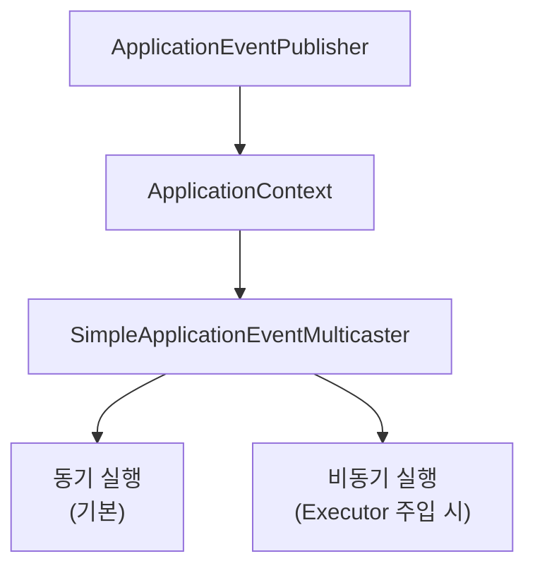

>[!Event-driven architecture]
>Event-driven programming is a paradigm where a system's flow is *processed around events*, which are essentially *signals or messages*. 
>- An event is triggered when a certain action occurs (e.g., user registration complete, order created, payment approved), and a listener detects this event to perform the necessary tasks.
>- It's all about "*reacting to the fact that something happened, without needing to know who caused it*."

| Key Concept                 | Component | Description                                                                                      |
| :-------------------------- | :-------- | :----------------------------------------------------------------------------------------------- |
| **Event**                   | Event     | A fact or action that has occurred within the system (e.g., `UserRegisteredEvent`).              |
| **Event Publishing**        | Publisher | The act of creating an event object and *broadcasting* it within the system.                     |
| **Listener**                | Listener  | A component that *defines actions to be performed* when a specific event occurs.                 |
| **Asynchronous Processing** | N/A       | Events and listeners are generally loosely coupled and can operate asynchronously when required. |
#### Advantages of Event-Driven Architecture
- **Low Coupling (Loosely Coupled)**: The publisher of an event and its handler *do not need to directly reference each other*.
- [[Separation of Concern (SoC)]]: Core business logic can be clearly separated from supplementary processes (like notifications, logging, etc.).
- **Improved Scalability/Extensibility**: Functionality can be flexibly extended by simply adding more event listeners.
#### Cautions
- Event-driven doesn't necessarily mean asynchronous. By default, event processing in Spring is **synchronous**.
- Because the event flow is not always explicit, *code tracing can become more difficult*.

# Spring's Event Handling Flow (High Level)
1. **Something happens** (e.g., a user signs up).
2. An **event object is created** (e.g., `UserRegisteredEvent`).
3. The **event is published** (using `ApplicationEventPublisher`).
4. An **event listener detects this event** and performs additional tasks (e.g., sending a welcome email).

>The Spring Framework internally provides a structure for handling event publishing and reception based on the `ApplicationEventPublisher` pattern. This enables communication between components within the application in an asynchronous or loosely coupled manner.
#### Defining Event Objects
- An **event** is just a simple object ([[POJO vs JavaBeans VS Spring Beans#POJO (Plain Old Java Object)|POJO]]) that signals **something happened**.
	- This makes it easier to define clean, decoupled event classes using any custom structure.
- As of **Spring 4.2+**, events **don’t need to extend** `ApplicationEvent` anymore.
```java
public class MemberRegisteredEvent {

    private final Member member;

	// event object
    public MemberRegisteredEvent(Member member) {
        this.member = member;
    }

    public Member getMember() {
        return member;
    }
}
```
#### Publishing Events: `ApplicationEventPublisher`
- Events are typically published within the `Service` layer after business logic has been processed. 
- Spring supports event publishing through the `ApplicationEventPublisher` interface.
```java
@Service
public class MemberService {

    private final MemberRepository memberRepository;
    // ✅ Spring will inject this automatically
    private final ApplicationEventPublisher eventPublisher; // <<

    // Constructor for dependency injection
    public MemberService(MemberRepository memberRepository, ApplicationEventPublisher eventPublisher) {
        this.memberRepository = memberRepository;
        this.eventPublisher = eventPublisher;
    }

    public void register(Member member) {
        // Save member information
        memberRepository.save(member); 
        // ✅ Publish the event (defined earlier)
        eventPublisher.publishEvent(new MemberRegisteredEvent(member)); 
    }
}
```
- The `publishEvent()` method propagates the event within the Spring context, and all listeners subscribed to this event are then invoked.
#### Receiving Events: `@EventListener`
- On the receiving and processing side of events, you can use the `@EventListener` annotation to define a method that will handle a specific event type. 
	- `@EventListener` -> *automatically executes a method* when it *detects a particular event type*.

```Java
@Component // Ensures this class is a Spring component and can be scanned
public class WelcomeEmailListener {

    @EventListener // This method will be called when a MemberRegisteredEvent is published
    public void handle(MemberRegisteredEvent event) {
        Member member = event.getMember();
        // Logic to send a welcome email
        System.out.println("Welcome email sent to: " + member.getEmail());
    }
}
```

- The `handle()` method in `WelcomeEmailListener` is **automatically triggered every single time a `MemberRegisteredEvent` is published** anywhere in your Spring application's context
	- like a subscription: the listener "subscribes" to that specific event type and acts whenever it "hears" it
- The event publisher (`MemberService`) does not need to know about the existence of the listener (`WelcomeEmailListener`).

# How Spring Events Are Processed Internally
> specific technical details of _how Spring makes that happen internally_
- When you call `ApplicationEventPublisher.publishEvent()` in Spring, the event is internally delivered to listeners and executed following a specific flow. 
- This process is managed by Spring's `ApplicationContext` and `Event Multicaster` mechanism.
#### Event Execution Flow
1. **Event Publication**: You, the developer, directly call `publishEvent(new SomeEvent(...))`.
2. **Delegation to `EventMulticaster`**: Internally, the [[IoC (Inversion of Control)#`ApplicationContext`|ApplicationContext]] passes the event to the `ApplicationEventMulticaster`.
3. **Listener Discovery and Execution**: The `EventMulticaster` finds all registered `@EventListener` or `ApplicationListener` type [[Bean|beans]].
4. **Event Delivery**: The event is then mapped to the appropriate listener method, and the method is executed.
5. **(Optional) Asynchronous Execution**: If an `@Async` annotation is present on the listener method, it will be executed in a separate thread.

```mermaid
flowchart TB
    A["ApplicationEventPublisher.publishEvent()"] --> B[ApplicationContext
    내부 처리]
    B --> C[ApplicationEventMulticaster
    수신]
    C --> D[등록된 리스너 탐색]
    D --> E[리스너 메서드 실행]
    E --> F{비동기 처리?}
    F -- NO<br>(defualt) --> G[동기 방식으로 실행 완료]
    F -- YES --> H[@Async로 비동기 실행]
```

#### Classes Involved in Event Processing
- The default implementation used for event processing is `SimpleApplicationEventMulticaster`. 
	- This multicaster is automatically registered during [[IoC (Inversion of Control)#`ApplicationContext`|ApplicationContext]] initialization.
		- [[Starting a Spring Boot Application]]
	- Internally, it iterates through registered listeners and, if the event type matches, executes them via `invokeListener()`.


- `ApplicationEventPublisher`
	- **Role**: An *interface* for **publishing events** within the application.
	- **Usage**: Used like `publisher.publishEvent(event)` to send an event throughout the system.
		- *It tells the [[IoC (Inversion of Control)#`ApplicationContext`|ApplicationContext]] that an event occurred!* The [[IoC (Inversion of Control)#`ApplicationContext`|ApplicationContext]] then receives the event and knows to pass it on to `SimpleApplicationEventMulticaster`
	- If possible it should be kept immutable
- `SimpleApplicationEventMulticaster`
	- **Default Implementation**: This is Spring's default concrete implementation of the `ApplicationEventMulticaster` interface.
	- **Role**: It **broadcasts (propagates) events to all registered listeners**.
	- **Registration Location**: Automatically registered as a Bean during `ApplicationContext` initialization.
-  Synchronous Execution (Default)
	- **Description**: Event listeners are invoked one by one, sequentially.
	- **Characteristics**: It's fast and simple, but if one listener is slow, the entire process flow can be delayed.
- Asynchronous Execution (When `Executor` is Injected)
	- **Description**: Can be executed asynchronously by injecting an `Executor` via `setTaskExecutor(...)`.
	- **Characteristics**: Each listener runs in parallel, which can reduce overall delay.

#### Asynchronous Event Processing using `@Async`
You can make an event listener process events asynchronously by annotating its method with `@Async`:
```java
@Component
public class WelcomeEmailListener {

    @Async // This method will be executed asynchronously
    @EventListener
    public void handle(MemberRegisteredEvent event) {
        sendWelcomeEmail(event.getMember());
    }
}
```
- You must add the `@EnableAsync` annotation to a configuration class (e.g., your main Spring Boot application class) for `@Async` to work.
	- scope는 현재 폴더 + 하위폴더
- When executed asynchronously, events are processed in a *separate thread pool*, which means it **does not impact the response time** of the main request thread.
- Be aware that **exception handling differs** in asynchronous methods, so special care is required.

#### Tips
- While event processing is effective for **separating business logic**, it can make code tracing more difficult. Therefore, be careful not to excessively rely on events for core business logic.
- To **control the execution order of listeners**, you can use the `@Order` annotation or implement `SmartApplicationListener`.

# Summary
- **Event-driven architecture**, utilizing `ApplicationEventPublisher` and `@EventListener`, reduces coupling and allows for flexible logic separation and asynchronous processing. 
- By default, Spring Boot handles events synchronously with `SimpleApplicationEventMulticaster`, but you can enable asynchronous processing by injecting an `Executor`.