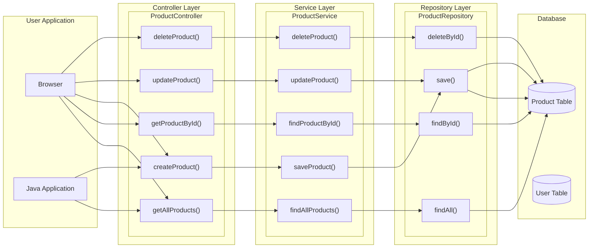

- [[Spring's main philosophies#SoC (Separation of Concerns)|Spring's main philosophies - SoC (Separation of Concerns)]]
- [[🐣Spring & SpringBoot]]
# Simplified diagram
```mermaid
graph LR
	A["Client(Browser)"] -->|HTTP Request| B[@Controller]
	B --> C[@Service]
	C --> D[@Repository]
	D --> E[(Database)]
	E --> D
	D --> C
	C --> B
	B -->|HTTP Reponse| A
```
- spring은 이 구조를 정말 **철저하게 지킴**!
	- controller, service, repository는 다 spring bean임
# Diagram


# Application Layers
![[Layered_architecture.png]]

| Layer          | Key Responsibility                   | Description                                                                                                                                                                             |
| :------------- | :----------------------------------- | :-------------------------------------------------------------------------------------------------------------------------------------------------------------------------------------- |
| **Controller** | Receives requests, returns responses | Controls the flow of processing by accepting client requests.<br>- doesn't know _how_ the business logic works or _how_ data is stored -> *just delegates*<br>- Contains [[⭐Spring MVC]] |
| **Service**    | Processes *business logic*           | Handles core domain logic and manages transactions.                                                                                                                                     |
| **Repository** | *Accesses data*                      | Only job is to communicate with the database (using JPA, MyBatis, etc.).<br>- knows nothing about business logiv                                                                        |
## `@Controller` / `@RestController`
- [[⭐Spring MVC#CSR vs SSR 😭| ⭐Spring MVC - CSR vs SSR 😭]]
- [[⭐ Handler Methods#Return types (outputs)| ⭐Handler Methods -Return types (differs based on the controllers)]]

| Annotation            | Description                                                                                                                                                                                                                                                                                               |
| :-------------------- | :-------------------------------------------------------------------------------------------------------------------------------------------------------------------------------------------------------------------------------------------------------------------------------------------------------- |
| **`@Controller`**     | Used in **View-based MVC applications**. <br>- Typically paired with template engines like `Thymeleaf` (which is often the default choice)<br>- When a method returns a `String`, it's interpreted as a view name to render.                                                                              |
| **`@RestController`** | Designed for **REST API responses**. <br>- Automatically includes `@ResponseBody`, meaning that whatever a method returns will be directly written into the HTTP response body (e.g., as JSON or XML), rather than being used to resolve a view.<br>- `@RestController` = `@Controller` + `@ResponseBody` |
- `@ResponseBody`
	- Java object -> [[JSON]], serializes return using Jackson 
		- [[Java Serialization (and persistence)]]
	- Used in methods inside `@Controller`
- `@RequestBody`
	- [[JSON]] → Java object, deserializes using **Jackson**
	- Used on method params for input parsing
```java
@RestController // This implies @Controller + @ResponseBody
@RequestMapping("/hello")
public class HelloController {

    @GetMapping // Handles GET requests to /hello
    public String sayHello() {
        // Returns the string "Hello, World!" directly as the HTTP response body
        // Spring (via Jackson, implicitly) converts this to a JSON string if needed by the client.
        return "Hello, World!";
    }
}
```
## `@Service`
- It's where you implement your application's **core business logic**, such as handling transactions and enforcing domain-specific rules
	- Business logic = Our requirements of the application
- The `@Service` annotation explicitly marks a class as a **service component**
- Use `@Transactional` annotation. Transactions are very important in backend applications 
	- [[Transaction|Transaction (Spring)]], [[Database Transaction]]
	- Uses [[AOP (Aspect Oriented Programming)]] internally
- Depends on `repository`
```java
@Service
public class ProductService {

    private final ProductRepository productRepository; // Injected by Spring

    // Constructor for dependency injection
    public ProductService(ProductRepository productRepository) {
        this.productRepository = productRepository;
    }

    // Method containing business logic
    public List<Product> findAllProducts() {
        return productRepository.findAll(); // Delegates to the repository for data access
    }
}
```

>[!tip]
>Where should you throw errors? (Repository vs. Service) => **SERVICE!**
>- Repository's Job 
>	- The repository's *only job is data access* (e.g., find, save). It should return data or an empty state (like `Optional.empty()`) to signal that data was not found. It shouldn't make decisions or know business rules.
>- Service's Job
>	- The service implements *business logic*. It calls the repository to fetch data and then decides if the outcome violates a business rule. For example, if the service needs to update a user but the repository returns `Optional.empty()`, the **service** throws a `UserNotFoundException` because the business rule is "a user must exist to be updated."
> 	 - Some services might allow creating users of the same name, some might not.

## `@Repository`
- The `@Repository` annotation marks a class as a **Data Access Object (DAO)**, meaning it directly communicates with the database.
	- This is the only component that directly communicates with the db
	- It essentially includes `@Component` internally and provides **automatic exception translation** -> This means database-specific exceptions (like a `SQLException`) are converted into Spring's consistent `DataAccessException` hierarchy, making error handling more uniform
	- Commonly used with technology like Spring Data JPA (ORM 같은 기술 - 데이터를 객채로 나눔), MyBatis Mapper (SQL Mapper), etc -> [[Spring Data Access Technologies]]
```java
@Repository
public interface ProductRepository extends JpaRepository<Product, Long> {
    // Spring Data JPA automatically provides basic methods like findById, findAll, save, etc.
}
```

When NOT using technology like Spring JPA:
>[!tip]
>- Use `Optional<T>` for methods that are expected to return **at most one** result.
>	- **One item is found:** The `Optional` will contain the item.
>	- **No item is found:** The `Optional` will be empty (`Optional.empty()`), returning `null`
>	- *In the service layer*, handle `null` by throwing error if it receives null 
>- Use a `Collection` (like `List<T>` or `Set<T>`) for methods that can return **zero or more** results.
>	- **One or more items are found**: The method returns a List containing those items.
>	- **No items are found**: The method returns an empty List. (not `null`, but represents perfectly an empty list)
>	- Avoid wrapping a collection in an `Optional` (i.e., `Optional<List<T>>`). This is considered an *anti-pattern*.

Examples of that: 
```java
@Override  
public Optional<BinaryContent> findById(UUID id) {  
    BinaryContent binaryContentNullable = null;  
    Path path = resolvePath(id);  
    if (Files.exists(path)) {  
        try (  
            FileInputStream fis = new FileInputStream(path.toFile());  
            ObjectInputStream ois = new ObjectInputStream(fis);  
        ) {  
            binaryContentNullable = (BinaryContent) ois.readObject();  
        } catch (IOException | ClassNotFoundException e){  
            throw new RuntimeException(e);  
        }  
    }  
    return Optional.ofNullable(binaryContentNullable);  
}  
  
@Override  
public List<BinaryContent> findByUserId(UUID userId) {  
    try (Stream<Path> paths = Files.list(DIRECTORY)){  
        return paths  
            .filter(path -> path.toString().endsWith(EXTENSION))  
            // convert each object in path  
            .map(FileBinaryContentRepository::getBinaryContent)  
            .filter(b -> b.getUserId().equals(userId))  
            .toList();  
    } catch (IOException e) {  
        throw new RuntimeException(e);  
    }  
}
```
# Dependency Relationships Between Layers
> MUST follow a **unidirectional dependencies** between layers
```
Controller → Service → Repository
```
- Things you MUST KEEP
	- You **must avoid** structures where the **Repository refers to the Service**, or the **Service refers to the Controller**, etc
	- Such *circular dependencies* can lead to structural issues and become a source of errors during testing and maintenance.

|Layer|Depends On|Dependency Type|
|:--|:--|:--|
|**Controller**|Service|Constructor Injection or Field Injection|
|**Service**|Repository|Constructor Injection|
|**Repository**|None (no lower layer)|N/A|
## An incorrect dependency direction:
```java
// BAD EXAMPLE: Avoid this!
@Repository
public class ProductRepository {

    @Autowired
    private ProductService productService;  // Prohibited: Do not reference Service from Repository
}
```
## Dependencies Between Services in the Same Layer
- It's actually common for one Service to depend on another Service. 
- Ex) if you're looking up order details and need information about the customer who placed the order, your `OrderService` might need to call `MemberService`
```java
@Service
public class OrderService {

    private final MemberService memberService; // OrderService depends on MemberService

    @Autowired
    public OrderService(MemberService memberService) {
        this.memberService = memberService;
    }

    /* Business logic to place an order */
    public void placeOrder(Long memberId) {

        // 1. Retrieve information for the currently logged-in user
        //    (ID provided as a parameter)
        Member member = memberService.findById(memberId); // Calling MemberService

        // 2. Order placement logic...
    }
}
```
- When you're doing something like this, still keep these rules
	- Unidirectional Flow (no circular dependencies, Spring will give u error)
	- Clear responsibilities - Don't let unrelated domains call each other directly—separate logic if needed
		- [[SRP(Single Responsibility Principle)]]
	- Respect Hierarchy - E.g., `OrderService → MemberService` is OK, but reverse might indicate poor design.
- But what if we need to make `MemberService` also depend on `OrderService`?
	- If `MemberService` also depends on `OrderService`, there would be a circular dependency (순환참조), and Spring will not proceed & give an error.
	- Things you can do:
		- Make `MemberService` depend on `OrderRepository` instead
			- But this is not recommended -> tight coupling, hard to test/debug
				- `MemberService` will also have responsibilities of `OrderRepository`, leading to *unclear boundary of responsibilities*
				- If possible, a layer should only depend on another domain *of the same layer*
		- Make one of those 2 an Event
		- Make an intermediary class (explained below)
#### Intermediary class
Alternatively, you can design a structure where multiple domains can cooperate through a dedicated component:
```java
/* Example of separating a collaboration-specific component */
@Component
public class OrderProcessManager {

    private final OrderService orderService;
    private final MemberService memberService;

    @Autowired
    public OrderProcessManager(OrderService orderService, MemberService memberService) {
        this.orderService = orderService;
        this.memberService = memberService;
    }

    public void placeOrderForMember(Long memberId) {

        Member member = memberService.findById(memberId);
        orderService.createOrder(member);
    }
}
```
- This avoids direct mutual references between the two services by using `OrderProcessManager` 
	- **Put the collaborative logic to a separate coordinator**. 
	- The `OrderProcessManager` automatically has its dependencies wired by Spring via constructor injection, and it internally still references `OrderService` and `MemberService`
	- The key is that *the services aren't directly coupled; they interact through an intermediary (the coordinator)*. This allows each service to focus solely on its own responsibilities.
#### Practical Design Tips
- Each layer should **only depend on the layer(s) below it**.
- For [[DI (Dependency Injection)]], primarily use **Constructor Injection**, implemented with Lombok's `@RequiredArgsConstructor` or Spring's `@Autowired`.
- When writing test code, clearly separating dependencies between layers makes *Mocking* and *unit testing* **significantly easier**.
	- **Slice Test**: Tests *a specific layer* in isolation (e.g., testing only the `Controller`). Dependent objects are replaced with fake objects (**Mocking**).
	- **Unit Test**: The smallest type of test, verifying that *a single method* works correctly.