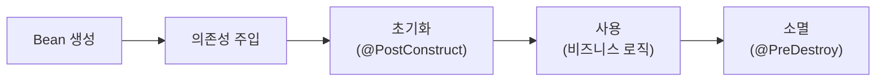

>[!Bean]
>Refers to an object managed by the [[IoC (Inversion of Control)#IoC Container|Spring IoC container]].  **Any object registered with Spring is a Bean**.
>- While it's a regular **[[POJO vs JavaBeans VS Spring Beans#POJO (Plain Old Java Object)|Plain Old Java Object (POJO)]]**, it becomes a special managed entity because Spring takes responsibility for its creation, initialization, dependency injection, and destruction. 

- Spring can manage the following types of objects as Beans:
	- Class instances annotated with `@Controller`, `@Service`, or `@Repository`.
		- [[⭐Layered Architecture]]
	- Objects returned by a method annotated with `@Bean`.
	- Objects registered with a `<bean>` tag in XML configuration.
- Spring *takes responsibility for its lifecycle and dependency injection during application execution*. 
	- This enables a structure where the container, not the developer, controls the entire process of an object's creation, initialization, use, and destruction
	- Enabled via [[@SpringBootApplication]]
	- [[IoC (Inversion of Control)]]
- To see more bean registration customizing - [notion notes](https://calm-individual-12a.notion.site/Spring-Boot-Bean-214c6b70982881c29231e5db9eca9f70)
# Registering Beans

|Registration Method|Description|Example Use|
|:--|:--|:--|
|**XML Config**|Uses the `<bean>` tag.|Legacy environments|
|**Java Config**|Uses `@Configuration` combined with `@Bean`.|Spring Boot and modern approaches|
|**Annotation Config**|Uses `@Component`, `@Service`, `@Repository`, etc.|Automatic detection based|
- Spring's official documentation recommends the **Java Config** method
- But in practice, a hybrid approach combining Java Config and Annotation Config is preferred

#### `@Configuration`
- Placing the **`@Configuration` annotation** at the class level declares that class as a **Configuration Metadata** source.
- Inside such a class, you'll define one or more **`@Bean` methods** (all of which are managed by the [[IoC (Inversion of Control)#IoC Container|Spring IoC container]]).
- Internally, `@Configuration` includes `@Component`, making it eligible for [[@SpringBootApplication#`@ComponentScan`|component scanning]].
#### `@Bean`
- The **`@Bean` annotation** is declared on a method to *register the object returned by that method as a Spring Bean*.
	- The return type can be any plain **POJO class** with no restrictions.
- An `@Bean` method can also configure explicit [[DI (Dependency Injection)]] by calling other `@Bean` methods that it depends on.
- Spring internally applies a **CGLIB proxy** to `@Configuration` classes. 
	- CCLIB ensures singleton
	- Even if `orderService()` directly calls `memberService()`, it will still return the _same_ instance of the `MemberService` Bean, ensuring *singleton behavior* where appropriate.

#### Bean name management
- **Default name:** Bean ID = name of the `@Bean` method
- **No duplicates allowed:** Duplicate names cause overwrite or exception
- **Custom name:** Use `@Bean(name = "customName")` to set explicitly

#### Code
```java
/* 설명. @Configuration
 *  해당 어노테이션이 정의된 클래스가 bean을 생성하는 클래스임을 의미한다.
 *  bean의 이름을 별도로 지정하지 않으면 해당 클래스의 첫 글자를 소문자로 취하여 설정된다.
 * */
/* Note.
 *  어노테이션을 클래스 선언 바로 위에 작성하면 class-level 어노테이션,
 *  메서드 선언 바로 위에 작성하면 method-level 어노테이션이라고 말한다
 * */
@Configuration("configurationSection02")
public class ContextConfiguration {

    /* 설명. @Bean
     *  해당 어노테이션이 정의된 메소드의 반환 값을 스프링 컨테이너에 bean으로 등록한다는 의미이다.
     *  이름을 별도로 지정하지 않으면 메소드 이름을 bean의 id로 자동 인식한다.
     *  @Bean("myName") 또는 @Bean(name="myName") 의 형식으로 bean의 id를 설정할 수 있다.
    * */
    @Bean(name="member")
    public MemberDTO getMember() {

        return new MemberDTO(1, "user01", "pass01", "홍길동");
    }


```
# Bean scope
> **When is it born and when is it destroyed?**
> - The extent to which the Spring container can manage an instance

Spring Beans are primarily managed as **Singletons** by default
- Unless configured otherwise, **a registered Bean exists as a unique, single instance within the IoC container**
- Other scopes are possible (explicitly state them)

| Scope                 | Description                                            |
| :-------------------- | :----------------------------------------------------- |
| `singleton` (default) | A single instance within the container.                |
| `prototype`           | A new instance is created for each request.            |
| `request`             | An instance is created per HTTP request (web context). |
| `session`             | An instance is created per HTTP session (web context). |
```java
// If the @Scope annotation is omitted, it defaults to singleton
@Scope("prototype")
@Component
public class MyBean { /* ... */ }
```
#### `singleton` (default)
- **Shared Instance:** One single object is reused.
- **One Per Container:** Only one instance of the Bean exists within the entire Spring container.
- **Creation Time:**
    - The object is created during Spring container initialization.
	    - [[Starting a Spring Boot Application]], [[IoC (Inversion of Control)#IoC Container|IoC Container]]
    - This occurs after all Bean configurations, injections, and creations are set up.
    - Specifically, it's at the point of [[DI (Dependency Injection)]] when the `ApplicationContext` is initialized.
- **Destruction:** The Bean is destroyed when the application terminates.
- Concurrency issues
	- Entities (like `User` or `Member` objects) that hold individual, mutable state (i.e., instance-specific fields) **are generally NOT registered as Beans** in the Spring container. Spring does not manage their lifecycle.
		- You (the developer) are responsible for creating instances of stateful objects.
		- Objects that hold mutable state per request/user, like the entities, are typically *NOT* registered as Beans.
	- Fields like a `repository` in a `Service` class, however, *are designed to share state* (e.g., a single connection pool, a single data access object instance). These _should_ be singletons.
```java
@Component
@Scope("singleton")  // 생략 가능: 기본값
public class MyService { }
```
#### `prototype`
- A **new instance is created every time it is injected**. (rarely used tho)
- **The developer must destroy it** (the developer is responsible for its destruction).
	- The container **does NOT manage the usage or destruction** of a prototype bean -> responsible **only for creation, injection, and initialization**.
- It is useful when the *state changes frequently*, or when heavy operations need to be performed by different objects each time.
```java
@Component
@Scope("prototype")
public class TaskProcessor { }
```
## Web Scope
- Manage **Bean lifecycles** in web applications
- Only valid in: `WebApplicationContext` (not standard [[IoC (Inversion of Control)#`ApplicationContext`|ApplicationContext]])
- Error if you directly try to inject them in a unit test 
	- separate configurations like `@WebMvcTest`, `Mockmcv`, or ``RequestScopeTestExecutionListener``
#### `request`
- A new Bean instance is created for **each HTTP request**.
- Used when you want to maintain state specific to a client request.
- The [[IoC (Inversion of Control)#IoC Container|IoC Container]] does not recognize this scope without an active HTTP request, an exception may occur during testing or initialization phases.
```java
@Component
@Scope("request")
public class RequestScopedBean {

    // Generates a new UUID for each request to use as an identifier
    private final UUID id = UUID.randomUUID();
    // ...
}
```


#### `session`
```java
@Component
@Scope("session")
public class SessionScopedBean {
    
    // 현재 세션에 로그인한 사용자 이름
    private String username;
}
```
- The Bean is maintained per **user session**.
	- A space for storing user information, managed on the server.
	- Utilized for managing session-based data such as logged-in user information or shopping cart contents.
- Frequently used in conjunction with `@SessionAttributes` or `HttpSession`.
#### `application`
- A single [[Bean]] instance is used across the entire `ServletContext` (Application scope).
	- scope covers the entire `ServletContext`, meaning it handles everything across the entire web application
- All requests and sessions within a single WAS (Web Application Server) context share this instance.
- While it might feel almost similar to a singleton, it is closer to a public storage area at the WAS level.
	- [[WAS vs Web Server]]
- Destroyed when the application terminates (similar to a singleton, as there is only one instance)
```java
@Component
@Scope("application")
public class AppWideStats {
    
    // 현재 우리의 웹 서비스에 방문한 사용자 수 누적 카운팅
    private AtomicInteger visitorCount = new AtomicInteger();
}
```
## Scope Proxy (`proxyMode`)
- Injecting a **web-scoped Bean** (e.g., `@RequestScope`, `@SessionScope`) into a **singleton Bean** (e.g., `@Service`) causes errors
    - Reason: Web-scoped Bean **doesn't exist at injection time**
- Solution: Use **scope proxy**
	- Spring injects a **proxy object**, deferring actual Bean resolution until runtime (e.g., during an HTTP request)
    - Enables safe use of web-scoped Beans inside singletons

This gives error because `OrderService` is a singleton bean and when application starts `sessionBean` needs to be injected
- but `sessionBean` may not exist yet
```java
@Service
public class OrderService {

    private final SessionScopedBean sessionBean; // 에러 가능

    public OrderService(SessionScopedBean sessionBean) {
        this.sessionBean = sessionBean;
    }
}
```

Solution:
```java
@Component
@Scope(scopeName = "session", proxyMode = ScopedProxyMode.TARGET_CLASS)
public class SessionScopedBean {
    ...
}
```
- `proxyMode = ScopedProxyMode.TARGET_CLASS` is configured, Spring injects a **proxy object** (a "*fake shell*" object) into the singleton Bean instead of the actual Bean

| Option                         | Description             | Characteristics                                                                                                | Code                                                                  |
| :----------------------------- | :---------------------- | :------------------------------------------------------------------------------------------------------------- | --------------------------------------------------------------------- |
| `ScopedProxyMode.TARGET_CLASS` | CGLIB-based class proxy | Creates a proxy by inheriting the target class itself.<br>- Use when class does not have an interface          | <br>@Scope(value = "session", proxyMode = ScopedProxyMode.INTERFACES) |
| `ScopedProxyMode.INTERFACES`   | JDK Dynamic Proxy       | Creates a proxy based on the interfaces implemented by the target object.<br>- Use when class has an interface | @Scope(value = "session", proxyMode = ScopedProxyMode.TARGET_CLASS)   |
1. **`ScopedProxyMode.TARGET_CLASS` (CGLIB Proxy)**
	- **How it works:** Spring uses a library called **CGLIB** (Code Generation Library) to create a **subclass** of your actual bean class at runtime. This dynamically generated subclass is the proxy.
	- **Inheritance-based:** The proxy _extends_ your original class.
```java
// Example: MyClass does NOT implement any interfaces
@Component
@Scope(value = "request", proxyMode = ScopedProxyMode.TARGET_CLASS)
public class MyClass { // No interface implemented
    public void doSomething() { /* ... */ }
}
```

2. **`ScopedProxyMode.INTERFACES` (JDK Dynamic Proxy)**
- **How it works:** Spring uses Java's built-in **JDK Dynamic Proxy** mechanism. This mechanism creates a proxy that **implements all the interfaces** that your actual bean class implements.
- **Interface-based:** The proxy _implements_ the same interfaces as your original class.
```java
// Example: MyInterface and MyClass implements MyInterface
public interface MyInterface {
    void doSomething();
}

@Component
@Scope(value = "request", proxyMode = ScopedProxyMode.INTERFACES)
public class MyClass implements MyInterface { // Implements an interface
    @Override
    public void doSomething() { /* ... */ }
}
```
# Beans and POJOs
![[beans-and-pojo.png]]
- [[POJO vs JavaBeans VS Spring Beans#POJO (Plain Old Java Object)|POJO (Plain Old Java Object)]]
- A Bean can fundamentally be a POJO. However, the moment Spring starts managing that POJO, it's a Bean.
- **Every Bean is a POJO, but not every POJO is a Bean.**
```java
// The instance of type MemberService returned by this method becomes a Bean
@Bean
public MemberService memberService() {

    return new MemberService();
}
```

- Spring allows POJOs to be registered as Beans without special constraints, which is based on the following design philosophies:
	- **Non-invasive:** The object itself doesn't depend on the Spring framework.
	- **Reusable existing code:** This makes testing, maintenance, and applying [[DI (Dependency Injection)]] easier.

# Bean Metadata
>For Spring to manage an object as a **Bean**, it requires metadata about that object. This metadata typically consists of the following items:
- Spring uses this information to configure the object within the container and control its lifecycle.
- **Bean Name (ID)**: A unique identifier.
- **Class Information**: The target class to be instantiated.
- **Dependency Information**: A list of other Beans that need to be injected.
- **Scope Information**: Such as singleton, prototype, etc.
- **Initialization/Destruction Methods**: Like `initMethod`, `destroyMethod`, etc.
- **Creation Timing**: Lazy or Eager.

# Bean's Life Cycle in [[IoC (Inversion of Control)#IoC Container|Spring IoC Container]]
- [[IoC (Inversion of Control)#`ApplicationContext`|ApplicationContext]]

- **Creation**: Instantiated via a default constructor or a method defined with the `@Bean` annotation, etc.
- **[[DI (Dependency Injection)|Dependency Injection]]**: Required Beans inside the created beans are injected through constructors, fields, setters, etc.
- **Initialization**: `@PostConstruct`, `InitializingBean.afterPropertiesSet()`, custom `init` methods, etc. are called.
	- 의존성 주입까지 완료된 후, 빈을 사용하기 전에 **초기화 작업을 수행**할 수 있는 단계
- **Usage**: The application performs actual business logic, and they use beans.
- **Callback before destruction**: Spring 컨테이너가 종료되기 직전, 빈이 소멸되기 전에 후처리 작업을 수행할 수 있는 단계다
	- `@PreDestroy`, `DisposableBean.destroy()` are called.
	- 사용했던 리소스 해제
- spring container ends, then all beans are destroyed
#### Tips
- **Bean lifecycle hooks** are appropriately used for initializing/cleaning up external resources (e.g., database connections, thread pools).
- It's recommended to use **only one method** for initialization/destruction to prevent conflicts in method order.
- **Bean definition conflicts** or duplicate registration errors primarily occur due to metadata conflicts.

# Bean Life-cycle Callbacks
#### Diagram
Spring Bean Lifecycle order:
1. The Spring IoC Container creates the Bean instance, then performs Dependency Injection (DI).
2. Once Dependency Injection is complete, `@PostConstruct` is called.
3. Next, `InitializingBean.afterPropertiesSet()` is called, followed by the method specified in `@Bean(initMethod=...)`. (This only applies if they are implemented or configured, respectively).
4. After going through the usage phase where actual service logic is performed, cleanup tasks begin when the application shuts down.
5. At the shutdown point, `@PreDestroy` is called, followed by `DisposableBean.destroy()`, and then the method specified in `@Bean(destroyMethod=...)`.
```mermaid
graph TD
    A[Bean 객체 생성] --> B["의존성 주입 (DI)"]
    B --> C[@PostConstruct 호출]
    C --> D["afterPropertiesSet() 호출<br/>(InitializingBean 구현 시)"]
    D --> E["init-method 호출<br/>(@Bean 설정 시)"]
    E --> F["사용 단계<br>(비즈니스 로직)"]
    F --> G[ApplicationContext<br>종료 시점]
    G --> H[@PreDestroy 호출]
    H --> I["destroy() 호출<br/>(DisposableBean 구현 시)"]
    I --> J["destroy-method 호출<br/>(@Bean 설정 시)"]
```
#### `initMethod` and `destroyMethod`
```java
@Bean(initMethod = "init", destroyMethod = "cleanup")
public MyBean myBean() {
    return new MyBean();
}
```
- `initMethod`: Specifies the method to be called immediately after the Bean is created.
- `destroyMethod`: Specifies the method to be called when the container is shut down.
	- **Caution:** `destroyMethod` only works for **singleton scope** Beans.
#### `@PostConstruct` and `@PreDestroy`
```java
@Component
public class MyComponent {

    @PostConstruct
    public void init() {
        System.out.println("Performing Bean initialization tasks");
    }

    @PreDestroy
    public void destroy() {
        System.out.println("Performing cleanup tasks before Bean destruction");
    }
}
```
- **`@PostConstruct`**: Called after the Bean has been created (at the point when dependency injection is complete).
- **`@PreDestroy`**: Called before the `ApplicationContext` is shut down.
- This is the most widely used approach and is well-compatible with Java-based Config and Spring Boot.

#### `InitializingBean` / `DisposableBean` Interfaces
```java
public class MyBean implements InitializingBean, DisposableBean {

    @Override
    public void afterPropertiesSet() {
        // Initialization logic
    }

    @Override
    public void destroy() {
        // Destruction logic
    }
}
```
- `afterPropertiesSet()`: Called after [[DI (Dependency Injection)]] is complete.
- `destroy()`: Called when the container is shut down.
- This method is **generally NOT commonly used** because it leads to tight coupling with Spring interfaces. Instead, `@PostConstruct` and `@PreDestroy` are preferred, and this approach is chosen only if necessary.

# Handling Beans of the Same Type
>How to handle beans when they have the same type:
## `@Primary`
- **designating a default Bean for injection** when multiple Beans of the same type exist
	- **On the component / bean definition side.** It tells Spring _this bean is the default choice for its type_.
- priority is lower than `@Qualifier`. You can attach `@Primary` to a common implementation and then use `@Qualifier` to inject a different implementation for testing or specific situations.
- However, among classes of the same type, only one can use the `@Primary` annotation
```java
@Component
@Primary
public class Charmander implements Pokemon {

    @Override
    public void attack() {
        System.out.println("파이리 불꽃 공격🔥");
    }
}
```
## `@Qualifier`
- **explicitly specify the exact Bean name** for injection
	- **on the calling side / injection point.** It tells Spring _which specific bean to inject here_
- can be used in any position (constructor, field, method) and allows you to clearly designate the desired Bean by name 
- the value passed to `@Qualifier` must match the `@Bean` method name or the name specified using `@Component("name")`
```java
@Service("pokemonServiceQualifier")
public class PokemonService {
	
	/* 설명. @Qualifier:
	 *  여러 개의 빈 객체 중에서 특정 빈 객체를 이름으로 지정하는 어노테이션이다.
	 *  @Primary 어노테이션과 @Qualifier 어노테이션이 함께 사용되는 경우, @Qualifier의 우선 순위가 높다.
	 * */
	
	/* 설명. #1 필드 주입 방식 */
//	@Autowired
//	@Qualifier("pikachu")
	private Pokemon pokemon;
	
	/* 설명. #2 생성자 주입 방식 */
	@Autowired
	public PokemonService(@Qualifier("squirtle") Pokemon pokemon) {
		this.pokemon = pokemon;
	}
	
	public void pokemonAttack() {
		pokemon.attack();
	}
}
```

## Identification via Bean Name: `@Resource`, `@Inject`
but we won't really use these, just know they exist
#### `@Resource`
- need to add separate dependencies for JDK 17 or later
- Can be used with setter and field injection

```java
/* Note. Based on Jakarta EE 10, Jakarta Annotation uses v2.1
 * https://projects.eclipse.org/releases/jakarta-10
 * */
implementation("jakarta.annotation:jakarta.annotation-api:2.1.1")
implementation("jakarta.inject:jakarta.inject-api:2.0.1")
implementation("commons-logging:commons-logging:1.2")
```

**Method of injecting by name:**
```Java
@Service("pokemonServiceResource")
public class PokemonService {

  /* Specify the bean named 'pikachu' */
	@Resource(name = "pikachu")
	private Pokemon pokemon;

	public void pokemonAttack() {
		pokemon.attack();
	}
}
```

**Method of injecting by type:**
```Java
@Service("pokemonServiceResource")
public class PokemonService {

  @Resource
	private List<Pokemon> pokemonList; // When injecting a collection

	public void pokemonAttack() {
		pokemonList.forEach(Pokemon::attack);
	}
}
```

#### `@Inject`
- supports constructor injection, setter injection, and field injection

**Field Injection**
```java
@Service("pokemonServiceInject")
public class PokemonService {

	/* 1. 필드 주입 */
	@Inject
	@Named("pikachu")
	private Pokemon pokemon;

	public void pokemonAttack() {
		pokemon.attack();
	}
}
```

**Constructor**
```java
@Service("pokemonServiceInject")
public class PokemonService {

	private Pokemon pokemon;

	/* 2. 생성자 주입 */
	@Inject
	public PokemonService(@Named("pikachu") Pokemon pokemon) {
		this.pokemon = pokemon;
	}

	public void pokemonAttack() {
		pokemon.attack();
	}
}
```

**Setter**
```java
@Service("pokemonServiceInject")
public class PokemonService {

	private Pokemon pokemon;

	/* 3. 세터 주입 */
	@Inject
	public void setPokemon(@Named("pikachu") Pokemon pokemon) {
		this.pokemon = pokemon;
	}

	public void pokemonAttack() {
		pokemon.attack();
	}
}
```
