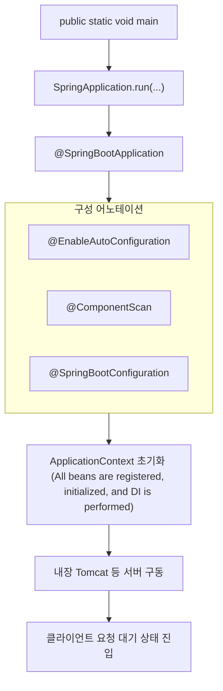

# `main` method
```java
@SpringBootApplication
public class DemoApplication {

    public static void main(String[] args) {
        SpringApplication.run(DemoApplication.class, args);
    }
}
```
- **Entry Point:**  
    Execution begins at `public static void main(String[] args)` — the standard Java application entry point
- `SpringApplication.run(...)`
	- Initializes the **Spring ApplicationContext** (the core container). 
		- [[IoC (Inversion of Control)#`ApplicationContext`|IoC - ApplicationContext container]]
	- Starts the embedded servlet container (e.g., Tomcat) if it’s a web app.
	- Loads configuration files and applies **auto-configuration**.
	- Performs **component scanning** to discover beans and dependencies
	- More of this down below

| Event class                         | 발생 시점        |
| ----------------------------------- | ------------ |
| ApplicationStartingEvent            | 애플리케이션 시작 직후 |
| ApplicationEnvironmentPreparedEvent | 환경 준비 직후     |
| ApplicationContextInitializedEvent  | 컨텍스트 초기화 직후  |
| ApplicationPreparedEvent            | Bean 등록 전    |
| ApplicationReadyEvent               | 모든 초기화 완료 후  |
-  **Embedded Server Startup (for web apps)**
    - Starts embedded servlet container (Tomcat, Jetty, Undertow) via `WebServerFactory`.
    - Registers `DispatcherServlet` to handle web requests.
- Main notes for `@SpringBootApplication` : [[@SpringBootApplication]]

# Visualization of the process

> The overall, higher-level flow of the _entire application startup_
1. **`main()` method** (Application Entry)
    - Starts the entire process.
2.  **`SpringApplication.run()`**  (The Grand Orchestrator)
	- Does NOT happen in the EXACT order linearly, in reality they are interleaved
	-  [[@SpringBootApplication]] (meta annotation) 
		1. **Creation and Initialization of `SpringApplication` Object**
			-     `SpringApplication.run(MyApp.class, args);`
		2. **Creation and Configuration of [[IoC (Inversion of Control)#`ApplicationContext`|ApplicationContext (the IoC Container)]]** 
			- Chooses [[IoC (Inversion of Control)#`ApplicationContext`|ApplicationContext]] implementation based on `WebApplicationType`:
		        - Servlet apps → `AnnotationConfigServletWebServerApplicationContext`
		        - WebFlux apps → `AnnotationConfigReactiveWebServerApplicationContext`
		        - Non-web apps → `AnnotationConfigApplicationContext`
		    - Runs registered `ApplicationContextInitializers` for customization.
		    - Configures Environment, `ApplicationContext`, and `ResourceLoader`
		3.  **Auto-Configuration Application** (`@EnableAutoConfiguration`)
		    - Applies configurations conditionally (e.g., `@ConditionalOnClass`, `@ConditionalOnMissingBean`) to register as [[Bean]].
			- Automatically loads and applies configuration candidates based on the classpath.
			- These are _not_ found by your application's `@ComponentScan` (they are in separate libraries)
			- [[@SpringBootApplication#`@EnableAutoConfiguration`|@SpringBootApplication - @EnableAutoConfiguration]]
		4.  **Component Scanning** (`@ComponentScan`)
			- Automatically discovers components (like `@Component`, `@Service`, etc.) within specified packages.
			- [[@SpringBootApplication#@ComponentScan|@SpringBootApplication - @ComponentScan]]
		5. **Processing of `@SpringBootConfiguration`**
			- Registers Java-based configuration classes, used for explicit Bean definitions.
			- *your own explicitly defined `@Bean` methods*
			- [[@SpringBootApplication#`@SpringBootConfiguration`|@SpringBootApplication - @SpringBootConfiguration]]
		6. **[[IoC (Inversion of Control)#`ApplicationContext`|ApplicationContext]] Refresh (Initialization of beans)**
			- ALL BEANS are **registered, initialized, and [[DI (Dependency Injection)|DI]] is performed**
			- Executes `CommandLineRunner` and `ApplicationRunner` beans.
		    - Publishes lifecycle events received by registered `ApplicationListener`s.
3. **Embedded Server Startup**
	- Transitions the application to a state where it can receive HTTP requests, typically on the default port (8080).
    - The application becomes ready to serve requests.
#### Summary of `SpringApplication.run()`
> 위에 거 옆에 두고 비교해보면 좋음
1. **Preparation:** `SpringApplication` object created, `Environment` set up, basic `ApplicationContext` type determined. (Your 2.1 and part of 2.2)
2. **Bean Definition Gathering:** This is where the `ApplicationContext` starts ***collecting definitions*** of all the beans it needs to create. This involves:
    - Processing `@SpringBootConfiguration` (your 2.5)
    - Performing `@ComponentScan` (your 2.4)
    - Applying `@EnableAutoConfiguration` (your 2.3) – all contributing bean definitions.
3. **Context Refresh (The Core Construction Phase):** Once all bean ***definitions are gathered***, the `ApplicationContext` "refreshes." This is a major phase where:
    - The `BeanFactory` *actually creates* the bean instances.
    - [[DI (Dependency Injection)]] is performed.
    - Lifecycle callbacks are executed.
    - Post-processors are applied.
    - `CommandLineRunner`/`ApplicationRunner`s are run.
    - Events are published. (This covers your 2.6)
4. **Finalization:** Embedded server startup. (Your main point 3)
# Different Events
> Spring Boot triggers various **lifecycle events** during its execution. These events allow developers to insert specific actions at crucial moments, such as right after the application starts or just before it shuts down.

| Event                                 | Description                                                                                                                                                   |
| :------------------------------------ | :------------------------------------------------------------------------------------------------------------------------------------------------------------ |
| `ApplicationStartingEvent`            | Fired immediately after the `SpringApplication.run()` method is called.                                                                                       |
| `ApplicationEnvironmentPreparedEvent` | Occurs after the `Environment` (e.g., properties, profiles) has been prepared.                                                                                |
| `ApplicationContextInitializedEvent`  | Fired right after the [[IoC (Inversion of Control)#`ApplicationContext`\|ApplicationContext]] has been initialized but before any [[Bean\|beans]] are loaded. |
| `ApplicationPreparedEvent`            | Triggered immediately after all preparations are complete, but before the context is refreshed.                                                               |
| `ApplicationStartedEvent`             | Fired right after the `ApplicationContext` has been refreshed and all beans are loaded.                                                                       |
| `ApplicationReadyEvent`               | Occurs when the application is **fully ready to serve requests**, after all `CommandLineRunner` and `ApplicationRunner` beans have been called.               |
| `ApplicationFailedEvent`              | Fired if the application fails to start due to an exception.                                                                                                  |
예시: 서버가 켜진 뒤 알림 보내기
```java
@Component
public class ServerReadyNotifier implements ApplicationListener<ApplicationReadyEvent> {
    @Override
    public void onApplicationEvent(ApplicationReadyEvent event) {
        // 예: 슬랙 메시지 전송
        slackService.send("서버가 준비되었습니다.");
    }
}
```

# Summary
- The call to `SpringApplication.run()` inside the `main()` method is not just a simple entry point—it serves as the **central control tower** that configures the entire Spring Boot execution       
- This flow can all be directly verified through debugging
	- Inside `refreshContext()`, the framework ultimately calls `context.refresh()`, transitioning the Spring container into a fully operational state.
- In practice, by using breakpoints to trace Spring’s execution flow and inspecting object states at each method call, you can **gain a deep understanding of the framework’s internal operations**
- Such practice-based learning provides the foundation for **strengthening diagnostic and problem-solving skills** when dealing with runtime errors or configuration conflicts that may arise later