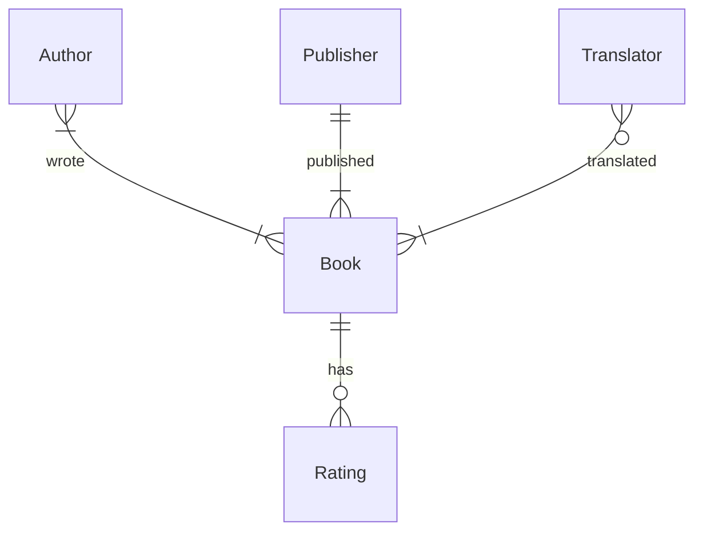

- What if we have multiple tables in a db?
- `.tables`
	- particular to sqlite that shows me the tables in this database
- ***Relational database***
	- Multiple tables that has a relationship among them
	- Ex) Author writing a book - table of authors and table of books
- ***Relationships***
	- **One to one (1:1)**
		- Authors only write one book
	- **One to Many (1:N)**
		- Authors can write multiple books
		- Many represents `0` or more, it asks the *maximum* number (cardinality)
	- **Many to Many (N:N)**
		- One author can write multiple books, A book can be written by more than one author
- 2 things in DB design
	- **Cardinality (The Maximum):** Can it be just one, or can it be many?
	- **Optionality (The Minimum):** Must it have at least one, or can it have zero?
	- When we name a relationship (like one to many or many to many), we only look at the cardinality (the maximums) and ignore the 0s
		- `0` or `1` -> "One"
		- `0` or Many -> "Many"

# ER Diagrams
- Tools to visualize - Entity Relationship Diagrams (ER Diagrams)

- Author and Book
	- **Many to Many** -> an author has one or many books, a book is written by one or many authors
- Publisher and Book
	- **One to Many** -> a publisher has one or many books, a book has only one publisher
	- `||` under publisher represents *exactly one (mandatory one)*
	- One to Many = Many to One (but in db design we just call it One to Many)
- Translator and Book
	- **Many to Many** -> a translator has one or many books, a book might have 0 or many translators (0 or more)
	- Even though a book might have `0` translators, it *can have many, so it's still a many to many relationship*
- Book and Rating
	- **One to Many** -> a book has 0 or many ratings (more than one), a rating is related to only one book
	- Even though a book can have `0` ratings, it *can have many, so it's still a one to many relationship*

- Crows foot notation
	 
	- Use these to represent relationships
- Examples (read to left to write)
	- 
		- An author writes one book (every author can have one book associated with them)
	- 
		- An author can have only one book *and* a book can have only one author
	- 
		- An author can have one or many books, and a book is written by at least one  or many authors
		- The one notation and many notation are combined
# Keys
- Keys help relate tables in SQL
- **Primary Key**
	- A unique identifier for any row in a table
	- Books - ISBN -> Every book has an unique identifier, like a key! Although using the ISBN itself would take lots of space, so using numbers starting from `1` instead is better
- **Foreign Key**
	- Taking a PK from a table and including it in a column in another table
- Examples
	- One to Many
		- 
		- We used ISBN here for the PK, but that's long, so we can just use our own using numbers from `1`
	- Many to Many
		- 
		- In a physical database like SQL, you cannot directly implement a many to many relationship, you need to create a new table in the middle -> **junction table**, or a **join table**
			- breaks many to many into 2 one to many relationships
			- contains Foreign Keys from both original tables
			- **composite key** -> The combination of these two keys usually forms the Primary Key for this new table
		- There is now a table called `authored` that maps the primary key of `books` (`book_id`) to the primary key of `authors` (`author_id`)
# Subqueries
- One query inside another query

## Example of a `one to many` (book, publisher) query
```sqlite
SELECT "title"
FROM "books"
WHERE "publisher_id" = (
    SELECT "id"
    FROM "publishers"
    WHERE "publisher" = 'Fitzcarraldo Editions'
);
```
- `()`
	- The query in the parenthesis will be run first
- We make the query more dynamic without having to hardcode values

## Example of a `many to many` query (author(s) who wrote the book Flights)
![[subquery-many-to=many.png]]
- Who wrote "Flights"?
	- Find `id` of flights in `books`
	- find `author_id` in `authored`
	- find `name` in `authors`
```sqlite
SELECT "name" FROM "authors"
WHERE "id" = (
    SELECT "author_id" FROM "authored"
    WHERE "book_id" = (
      SELECT "id" FROM "books"
      WHERE "title" = 'Flights'
    )
);
```
- The first query that is run is the most deeply nested one — finding the ID of the book Flights. Then, the ID of the author(s) who wrote Flights is found. Last, this is used to retrieve the author name(s).

### `IN`
- But what if there are multiple authors of the same book?
```sqlite
SELECT "name" FROM "authors"
WHERE "id" IN (       -- Change '=' to 'IN' here
    SELECT "author_id" FROM "authored"
    WHERE "book_id" = (
      SELECT "id" FROM "books"
      WHERE "title" = 'Flights'
    )
);
```

- If you want all books from one author
```sqlite
SELECT "title" FROM "books"
WHERE "id" IN (
    SELECT "book_id" FROM "authored"
    WHERE "author_id" = (
        SELECT "id" FROM "authors"
        WHERE "name" = 'Fernanda Melchor'
    )
);
```
- You use `IN` because `book_id` might return more than 1 results
- Using `=`
	- The behavior of `=` depends entirely on what the subquery returns at the specific moment you run
	- So if `"book_id` happens to return 1 result then `WHERE "id" = ` would work OK, but if it returns 2+ then it causes a runtime error
- So you should know the relationship beforehand -> basically you should code based on the ER Diagram 
	- Use `=` when you're querying a column with a unique constraint or a primary key
		- Example: `WHERE id = (SELECT id FROM authors ...)`
		- Since an ID is unique, you are guaranteed to never get more than one result.
	- Use `IN` for everything else (esp for FKs or regular columns)
		- Example: `WHERE id IN (SELECT book_id FROM authored ...)`
		- Using `IN` "future-proofs" your query so it doesn't break when the data changes
# `JOIN`
- Combining tables
	- We *DO NOT* get back a new permanent table in storage -> it creates a ***result set***
	- `JOIN` just temporarily "stitches" them together for you to read
- Database we will use (`sea_lions`, `migrations`)
	- 
## INNER JOIN (intersection)
- only keeps data where **both** tables have a match
```sqlite
SELECT * FROM "sea_lions"
JOIN "migrations" ON "migrations"."id" = "sea_lions"."id";
```
- We have ONLY rows that could actually JOIN together
	- If the `id` is not existing in the other table, it gets removed (for both tables)
```sql
+-------+-------+------------------------+-------+----------+------+
|  id   | name  |        species         |  id   | distance | days |
+-------+-------+------------------------+-------+----------+------+
| 10484 | Ayah  | Zalophus californianus | 10484 | 1000     | 107  |
| 11728 | Spot  | Zalophus californianus | 11728 | 1531     | 56   |
| 11729 | Tiger | Zalophus californianus | 11729 | 1370     | 37   |
| 11732 | Mabel | Zalophus californianus | 11732 | 1622     | 62   |
| 11734 | Rick  | Zalophus californianus | 11734 | 1491     | 58   |
+-------+-------+------------------------+-------+----------+------+
```
## OUTER JOIN (extensions)
- `OUTER` keyword is often optional in syntax (`LEFT JOIN = LEFT OUTER JOIN`)
- `LEFT, RIGHT, FULL`
### LEFT JOIN (`LEFT OUTER`)
- Prioritize the data on the left table (1st table that you start with)
```sqlite
SELECT * FROM "sea_lions"
LEFT JOIN "migrations" ON "migrations"."id" = "sea_lions"."id";
```

```sql
+-------+--------+------------------------+-------+----------+------+
|  id   | name   |        species         |  id   | distance | days |
+-------+--------+------------------------+-------+----------+------+
| 10484 | Ayah   | Zalophus californianus | 10484 | 1000     | 107  |
| 11728 | Spot   | Zalophus californianus | 11728 | 1531     | 56   |
| 11729 | Tiger  | Zalophus californianus | 11729 | 1370     | 37   |
| 11732 | Mabel  | Zalophus californianus | 11732 | 1622     | 62   |
| 11734 | Rick   | Zalophus californianus | 11734 | 1491     | 58   |
| 11790 | Jolee  | Zalophus californianus | NULL  | NULL     | NULL |
+-------+--------+------------------------+-------+----------+------+
```
- You have *all* of the `sea_lion`
### RIGHT JOIN (`RIGHT OUTER`)
```sqlite
SELECT * FROM "sea_lions"
RIGHT JOIN "migrations" ON "migrations"."id" = "sea_lions"."id";
```

```sql
+-------+--------+------------------------+-------+----------+------+
|  id   | name   |        species         |  id   | distance | days |
+-------+--------+------------------------+-------+----------+------+
| 10484 | Ayah   | Zalophus californianus | 10484 | 1000     | 107  |
| 11728 | Spot   | Zalophus californianus | 11728 | 1531     | 56   |
| 11729 | Tiger  | Zalophus californianus | 11729 | 1370     | 37   |
| 11732 | Mabel  | Zalophus californianus | 11732 | 1622     | 62   |
| 11734 | Rick   | Zalophus californianus | 11734 | 1491     | 58   |
| NULL  | NULL   | NULL                   | 11735 | 2723     | 82   |
| NULL  | NULL   | NULL                   | 11736 | 1571     | 52   |
| NULL  | NULL   | NULL                   | 11737 | 1957     | 92   |
+-------+--------+------------------------+-------+----------+------+
```
- You have *all* of the `migrations`
### FULL JOIN (`FULL OUTER`)
```sqlite
SELECT * FROM "sea_lions"
FULL JOIN "migrations" ON "migrations"."id" = "sea_lions"."id";
```
- Lets us see both tables & which values are missing

```sql
+-------+--------+------------------------+-------+----------+------+
|  id   | name   |        species         |  id   | distance | days |
+-------+--------+------------------------+-------+----------+------+
| 10484 | Ayah   | Zalophus californianus | 10484 | 1000     | 107  |
| 11728 | Spot   | Zalophus californianus | 11728 | 1531     | 56   |
| 11729 | Tiger  | Zalophus californianus | 11729 | 1370     | 37   |
| 11732 | Mabel  | Zalophus californianus | 11732 | 1622     | 62   |
| 11734 | Rick   | Zalophus californianus | 11734 | 1491     | 58   |
| 11790 | Jolee  | Zalophus californianus | NULL  | NULL     | NULL |
| NULL  | NULL   | NULL                   | 11735 | 2723     | 82   |
| NULL  | NULL   | NULL                   | 11736 | 1571     | 52   |
| NULL  | NULL   | NULL                   | 11737 | 1957     | 92   |
+-------+--------+------------------------+-------+----------+------+
```

## NATURAL JOIN
- Just syntactic sugar
	- works similarly to an `INNER JOIN`
- Both tables in the sea lions database have the column `id`. Since the value on which we are joining the tables has the same column name in both tables, we can actually omit the `ON` section of the query while joining
```sqlite
SELECT * FROM "sea_lions"
NATURAL JOIN "migrations";
```

```sql
+-------+-------+------------------------+----------+------+
|  id   | name  |        species         | distance | days |
+-------+-------+------------------------+----------+------+
| 10484 | Ayah  | Zalophus californianus |   1000   | 107  |
| 11728 | Spot  | Zalophus californianus |   1531   | 56   |
| 11729 | Tiger | Zalophus californianus |   1370   | 37   |
| 11732 | Mabel | Zalophus californianus |   1622   | 62   |
| 11734 | Rick  | Zalophus californianus |   1491   | 58   |
+-------+-------+------------------------+----------+------+
```
- no duplicate `id` column!

## Self join (a technique)
- It's a technique where you join a table to itself
	- You use a regular `INNER JOIN` or `LEFT JOIN`, but you reference the same table on both sides.
- Used to compare rows of the same table
- Helps to display a hierarchy of data

# Sets
## `INTERSECT`
- 
```sqlite
SELECT "name" FROM "translators"
INTERSECT
SELECT "name" FROM "authors"
```

## `UNION`
- person is either an author or a translator or both
- 
```sqlite
SELECT "name" FROM "translators"
UNION
SELECT "name" FROM "authors";
```

```sqlite
SELECT 'author' AS "profession", "name" FROM "authors"
UNION
SELECT 'translator' AS "profession", "name" FROM "translators";
```
- Hardcoding a Column / Discriminator Column
	- `SELECT 'author' ...`: This tells the database: "For every single row you find in the authors table, just write the word 'author' in the first column."
	- `SELECT 'translator' ...`: This does the same for the second table.
	- There is NO  `author` or `translator` column

## `EXCEPT`
- 
```sqlite
SELECT "name" FROM "authors"
EXCEPT
SELECT "name" FROM "translators";
```

## Practice
- 
```sqlite
(
    SELECT "name" FROM "translators" 
    UNION 
    SELECT "name" FROM "authors"
)
EXCEPT
(
    SELECT "name" FROM "translators" 
    INTERSECT 
    SELECT "name" FROM "authors"
);
```

- Books that have 2 translators
```sqlite
SELECT "book_id" FROM "translated"
WHERE "translator_id" = (
    SELECT "id" from "translators"
    WHERE "name" = 'Sophie Hughes'
)
INTERSECT
SELECT "book_id" FROM "translated"
WHERE "translator_id" = (
    SELECT "id" from "translators"
    WHERE "name" = 'Margaret Jull Costa'
);
```
# Groups
## `GROUP BY`
- Getting the average ratings by book id
```sqlite
SELECT "book_id", AVG("rating") AS "average rating"
FROM "ratings"
GROUP BY "book_id";
```

`HAVING` keyword
- Getting avg ratings by book id but more than 4.0
```sqlite
SELECT "book_id", AVG("rating") AS "average rating"
FROM "ratings"
GROUP BY "book_id"
HAVING "average rating" > 4.0;
```
- because they're now groups and not individual rows, we need to use a different keyword for conditions on groups
	- `HAVING`
  
